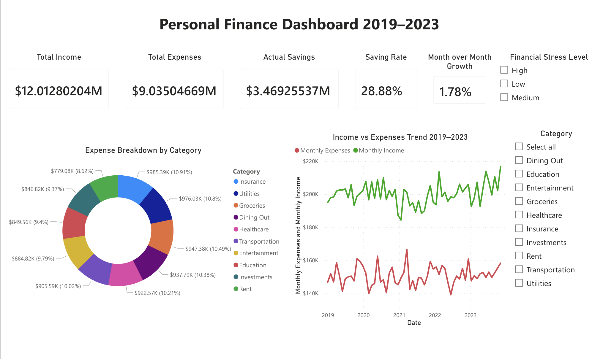
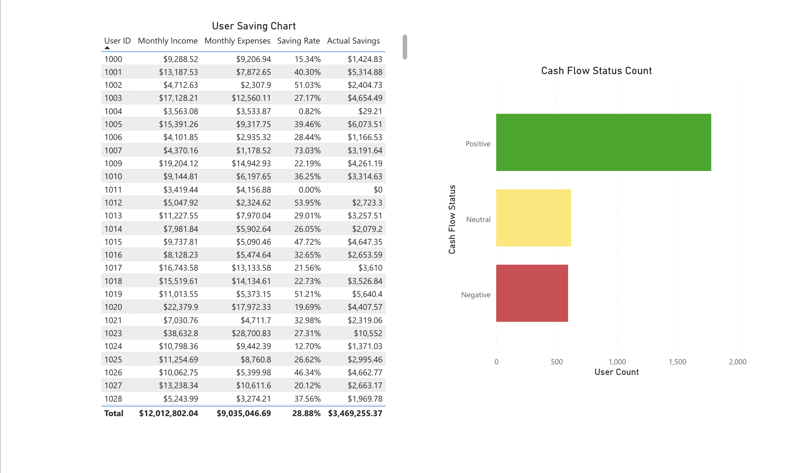

# personal-finance-dashboard
Interactive Power BI dashboard analyzing personal finance data (2019–2023) | DAX measures, KPI tracking, expense breakdown &amp; trend analysis

# Personal Finance Dashboard (Power BI)

## Project Overview
An interactive Power BI dashboard analyzing personal 
finance data from 2019–2023, covering income, expenses, 
savings, and cash flow patterns across multiple users.

## Dataset
- Source: Kaggle - Personal Finance Tracker Dataset
- Records: 99+ transactions
- Fields: 25 columns including income, expenses, 
  savings, category, stress level, cash flow status

## Features
- KPI Cards: Total Income, Total Expenses, 
  Actual Savings, Saving Rate, MoM Growth
- Expense Breakdown by Category (Donut Chart)
- Income vs Expenses Trend 2019–2023 (Line Chart)
- User-level Financial Summary Table
- Cash Flow Status Distribution (Bar Chart)
- Interactive Slicers: Financial Stress Level, Category

## DAX Measures Created
- Total Income
- Total Expense  
- Net Savings
- Saving Rate = Net Savings / Total Income
- MoM Growth (Month-over-Month expense growth)

## Tools Used
- Power BI Service
- Power Query (data cleaning)
- DAX (calculated measures)

## Dashboard Preview

